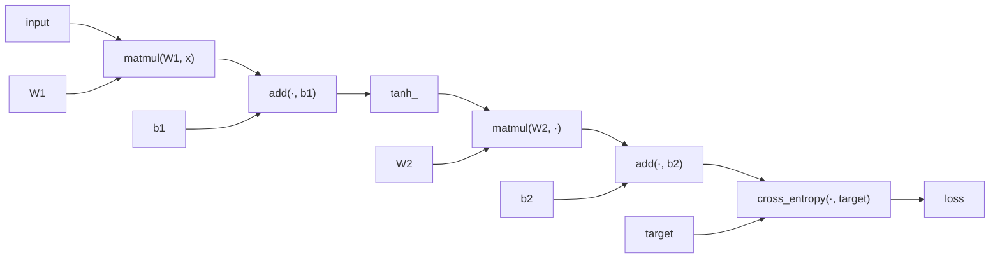
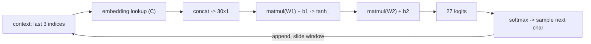

# tensorgrad-cpp

A tensor automatic-differentiation engine written from scratch in C++ — no libraries, no frameworks. A graph of nodes, the chain rule, and `std::shared_ptr`, except every node holds a whole matrix instead of a single number. The engine is used to train two things: an MNIST digit classifier and a character-level name generator.

It is the third repo in a line, each built on the one before it:

- **CNeural** — backpropagation derived by hand and written as fixed code for one specific network. Matrices, no autograd.
- **micrograd-cpp** — an engine that works out backpropagation automatically at runtime for any expression, but one scalar per node — too small to train anything real.
- **tensorgrad-cpp** — the same automatic engine, but every node holds a matrix. A matrix multiply is one node with one backward rule instead of thousands of scalar nodes. Enough to actually train a model.

CNeural hand-coded the gradients; micrograd automated them for scalars; tensorgrad automates them for tensors, and then uses that to train real models with no ML libraries in the stack.

---

## The engine

The core is the same as micrograd — a graph of operations walked backward with the chain rule — with one change: each `Value` node stores a `Matrix data` and a `Matrix grad` instead of a single number.

The graph machinery is unchanged: the `shared_ptr` edges, the topological sort, the reverse-walk backward pass, the accumulation of gradients — none of it cares what a node holds. What changes is each operation's backward rule, which becomes matrix calculus. Those are the same matrix backprop rules derived by hand in CNeural (BP1–BP4), now attached automatically to each node the moment it is built.

A network is one big expression. Building it also builds the graph:



`backward()` seeds the loss node's gradient to 1, walks the graph in reverse, and at each node applies that operation's local rule:

| operation | backward rule |
|---|---|
| `matmul` | `A.grad += C.grad · Bᵀ`,  `B.grad += Aᵀ · C.grad` |
| `add` | gradient passes straight through to both inputs |
| `tanh_` | `A.grad += (1 − C²) ⊙ C.grad` |
| `cross_entropy` (softmax + CE, fused) | `logits.grad += softmax(logits) − target` |
| `concat` | each input gets its slice of the output's gradient |

Training is then: build the loss as one `Value`, call `backward()` to fill every parameter's gradient, and step each parameter against its gradient.

---

## MNIST classifier

A 784 → 128 → 64 → 10 network, trained entirely through the automatic backward pass. Eight epochs over 60,000 images:

```
epoch: 0   loss: 0.3003   acc: 90.91%
epoch: 4   loss: 0.0578   acc: 98.23%
epoch: 7   loss: 0.0284   acc: 99.14%
training took 399 seconds
TEST accuracy: 96.11%
```

CNeural already reached this accuracy by hand. The point here is that no gradients were derived or written by hand — the engine computed all of them automatically, and the network still learned. Same result, calculus is now the program's job.

**Running it.** Put the four MNIST files (`train-images`, `train-labels`, `t10k-images`, `t10k-labels`) in `data/`, then:

```
make run       # trains, writes six weight matrices to model/
make predict   # loads model/, predicts one random test image
```

A trained `model/` is included, so `make predict` works straight after cloning.

---

## makemore — character-level name generator

The same engine pointed at language. It generates names one character at a time by predicting the next character from the previous ones. Predicting the next character is classification over the alphabet — the same machinery as MNIST, `cross_entropy` and all, with 27 classes instead of 10 — so most of the model is the engine already built above. Reuses `value.hpp`, `matrix.hpp`, and `serialize.hpp` unchanged.

Built in two steps:

**Bigram baseline** (`bigram.cpp`) — the sanity check the neural model has to beat. Counts how often each character follows each other across all 32,033 names, normalizes each row into a probability distribution, and samples. No engine, no gradients — a 27×27 count table. Average negative-log-likelihood: **2.454**.

**MLP name generator** (`names.cpp`) — the neural model (Bengio 2003 / Karpathy's makemore). Takes the last three characters, embeds each into a learned vector, concatenates them, and runs that through a hidden layer and an output layer to predict the next character. Trained through the same backward pass as MNIST, it reaches average loss **2.25** — below the bigram baseline, which is the reason for building it. It then samples names one character at a time until it draws an end token:

```
mary   joana   jose   katav   kamari   ryca   fina   delynn
```

These are not names from the dataset — the model invented them after learning what names tend to look like.

The pipeline for one character:



**Embeddings** are the one new idea. The bigram model treats a character as a bare index — nothing says two vowels are more alike than a vowel and a consonant. An embedding replaces that index with a small learned vector, trained by gradient descent along with everything else, so characters that behave similarly end up with similar vectors. The lookup is a one-hot vector times an embedding matrix, which is a row selection and reuses `matmul` with no new code. Same idea as GPT's token embeddings, at 27 characters instead of 50,000 tokens.

**`concat`** is the one new engine op. The three character embeddings must be stacked into a single input vector, with gradient flowing back through the stack to each embedding. `concat` stacks column `Value`s on the forward pass and scatters the output's gradient back to each input on the backward. It was gradient-checked in isolation on hand-computed numbers before being used in the model.

**Running it.** Needs `data/names.txt` (a newline-separated names file):

```
make bigram          # count-table baseline + its NLL
make names           # trains the MLP, saves weights to model_names/, generates
make generate_names  # loads saved weights and generates — no training
```

A trained `model_names/` is included, so `make generate_names` works straight after cloning.

---

## Files

The code is header-only where it can be, each file doing one job.

**Engine and shared math**
- `matrix.hpp` — a `Matrix` in a flat row-major array, with the operations backprop needs: multiply, add, subtract, transpose, element-wise apply, Hadamard product. Every operation returns a new matrix.
- `value.hpp` — the engine. A `Value` node holds its data and gradient (both matrices), its child nodes, and a `_backward` closure that pushes gradient to those children. The ops — `matmul`, `add`, `tanh_`, `cross_entropy`, `concat` — each build a node, record its children, and attach the matrix backward rule. `backward()` topologically sorts the graph and walks it in reverse.
- `serialize.hpp` — `save_matrix` writes a matrix as plain text (shape, then values at full precision); `load_matrix` reads it back. A saved model is just matrices on disk.

**MNIST**
- `mnist.hpp` — parses the raw binary MNIST files, loads images as 784×1 columns scaled to 0–1, one-hot encodes labels, picks the best guess with `argmax`. Reused from CNeural.
- `main.cpp` — the trainer. Loads data, builds parameters, runs the loop (zero grads, forward, `backward()`, step), reports loss and accuracy per epoch, saves weights to `model/`.
- `predict.cpp` — inference. Loads saved weights, runs one forward pass on a random test image, reports the prediction. No training.

**makemore**
- `makemore.hpp` — the shared plumbing: reads the names file, maps characters to indices and back, slides a window over each name to build (context → next-character) pairs, and holds the embedding lookup, concatenation, and autoregressive sampling used by both the trainer and the inference program.
- `bigram.cpp` — the count-table baseline.
- `names.cpp` — the MLP trainer. Builds the parameters, trains through the engine on shuffled examples, saves weights to `model_names/`, and generates a batch.
- `generate_names.cpp` — inference. Loads the saved weights and generates names. No training.

**Build**
- `Makefile` — targets: `run`, `predict` (MNIST); `bigram`, `names`, `generate_names` (makemore); `clean`. Flags: `-std=c++17 -Wall -Wextra -Wpedantic -O2 -g`.

Only a C++17 compiler is required.

---

## Notes

Built one piece at a time, checking each operation on small matrices worked out by hand before moving on — the `matmul` backward against a hand-computed gradient, the shared-node case to confirm gradients accumulate, `concat` against hand-computed slices, and the whole engine cross-checked against micrograd (the scalar version) on the same tiny expression, since two engines that share no code agreeing is the strongest proof it is right. Two bugs worth recording from the makemore work: embeddings that silently never trained until the embedding table was added to the parameter list, and a name generator that produced only `z`-names until the training data was shuffled each epoch — the loss looked fine because it was averaged over the epoch while the final weights had overfit the file's `z`-heavy tail.

The rule throughout was to look up how something works when stuck, but never to copy a finished solution.

tensorgrad extends the micrograd idea (from Andrej Karpathy's *Neural Networks: Zero to Hero*) from scalars to tensors. makemore follows the design of Karpathy's makemore. The matrix backpropagation comes from my own CNeural.
